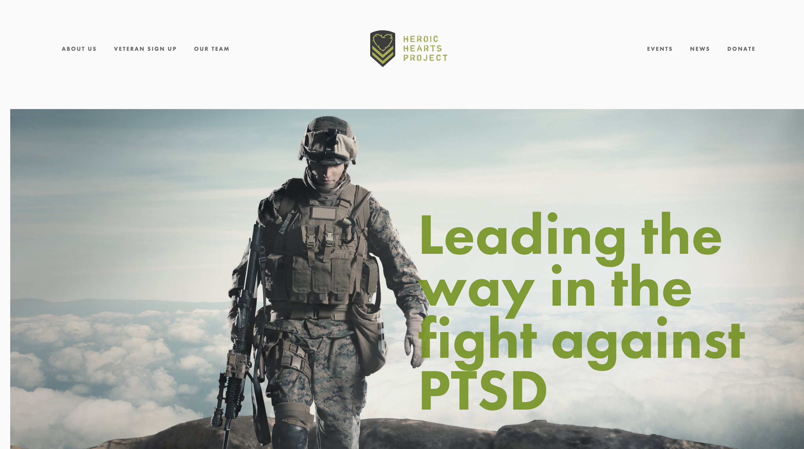

# Jesse Gould Professional Portfolio
---

## - Work in progress -

---
**Overview**:

A dedicated professional who brings creativity, passion, and unique vision to every project he is engaged in.

* B.A. in Economics from Cornell University
* Non-commissioned Officer as a US Army Ranger
* Founder of a registered 501(c)(3) nonprofit organization 
* Experience in finance, business management, and website development

---
**Website & Graphic Design Experience**

1.  Worked with SquareSpace and Wix
2.  Created professional website for nonprofit foundation Heroic Hearts Project
3.  Created dozens of graphics for marketing and promotional purposes
   

Sample:

---
**Professional Social Media Accounts**  

Jesse Gould

[LinkedIn Profile](https://www.linkedin.com/in/jesse-gould-62515a7)

[GitHub Page](https://github.com/jcgould48/Jesse-Gould-Portfolio)

Heroic Hearts Project Business Pages

[Website](https://www.heroicheartsproject.org)

[Instagram](https://www.instagram.com/heroicheartsproject/)

[Twitter](https://twitter.com/weheroichearts/)

---

